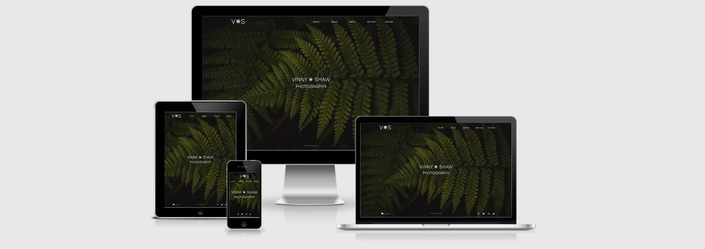
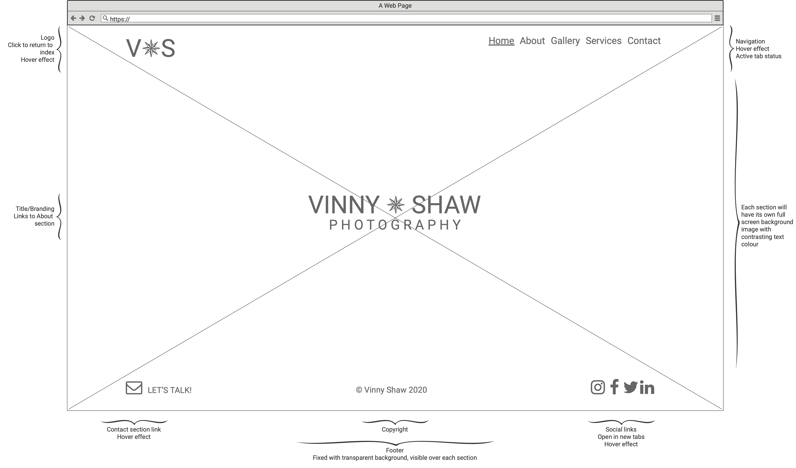

# VINNY SHAW PHOTOGRAPHY

Welcome to my Code Institute MS1 Project: User Centric Frontend Development.

A website is designed to be the online hub for the business **Vinny Shaw Photography**, to showcase their work, promote the services they offer and provide information for new and existing clients to easily contact them.

## [Click to visit live demo site](https://vinnyshaw.github.io/vinny-shaw-photography-ci-ms1/#home)

## Table of contents

- [User Experience](https://github.com/VinnyShaw/vinny-shaw-photography-ci-ms1/blob/master/README.md#user-experience)

- [Features](https://github.com/VinnyShaw/vinny-shaw-photography-ci-ms1/blob/master/README.md#features)
- [Technologies Used](https://github.com/VinnyShaw/vinny-shaw-photography-ci-ms1/blob/master/README.md#technologies-used)
- [Testing](https://github.com/VinnyShaw/vinny-shaw-photography-ci-ms1/blob/master/README.md#testing)
- [Deployment](https://github.com/VinnyShaw/vinny-shaw-photography-ci-ms1/blob/master/README.md#deployment)
- [Credits](https://github.com/VinnyShaw/vinny-shaw-photography-ci-ms1/blob/master/README.md#credits)

## User Experience

The aim of this website is to present the skills, services, work examples and contact information of the owner, in a clear and stylish manner.

Simple, minimal font styles and text placement allow the user to easily navigate the content and information, while experiencing a full-page presentation of the owners work throughout.

- Wireframes

  

  - [Mobile](assets/wireframes/6-mobile-wire.png)
  - [Desktop Home](assets/wireframes/1-desktop-index-wire.png)
  - [Desktop About](assets/wireframes/2-desktop-about-wire.png)
  - [Desktop Gallery](assets/wireframes/3-desktop-gallery-wire.png)
  - [Desktop Service](assets/wireframes/4-desktop-services-wire.png)
  - [Desktop Contact](assets/wireframes/5-desktop-contact-wire.png)

- Desktop mockup
  - [Home Mockup](assets/wireframes/8-desktop-index-mock.png)

## Features

#### Existing

- **About** - allows users to learn about Vinny Shaw by reading a short biography.
- **Gallery** - gives the user an opportunity to browse some previous work examples.
- **Services** - provides the user with the types of services offered.
- **Contact** - allows the user to quickly contact the site owner by filling out and submitting a short form.
- **Social media links** - the footer offers external links to the owners various social media accounts which will open in a new tab.
- **Contact link** - a user wishing to contact the owner, from any point of the site, can simply click the internal link to take them to the Contact section.

#### Future Options

- **Theme** - a toggle in header would allow the user to switch between Light and Dark site themes. The users system preferences would also trigger this preference.

## Technologies Used

- [HTML5](https://en.wikipedia.org/wiki/HTML5)
  - The basic level elements of the site are built using this markup language.
- [CSS3](https://en.wikipedia.org/wiki/CSS)
  - The custom styling and responsive media queries are written in CSS.
- [JQuery](https://jquery.com)
  - A script has been used to aid the minimal design by fading out the opacity of section text, to avoid any clashes with the navigation menu in the transparent header, as the user scrolls.
  - [Script credit](https://github.com/VinnyShaw/vinny-shaw-photography-ci-ms1/blob/master/README.md#credis)
- [Bootstrap V4.5.3](https://getbootstrap.com)
  - The site was developed using the **Bootstrap** CSS Framework for a mobile-first responsive design. This framework has been used, along with custom CSS, for the site layout, gallery carousel and contact form.
- [Font Awesome](https://fontawesome.com)
  - Ready made, customizable icons from **Font Awesome** have been used for the Contact and Social Media links.
- [Google Fonts](https://fonts.google.com)
  - The font _Work Sans_ from **Google Fonts** has been used to aid the minimal typography style choice of the design.
- [TinyPNG](https://tinypng.com)
  - Used to compress all images on the site to aid loading times/scores.
- [Adobe Photoshop](https://www.adobe.com/uk/products/photoshop.html?gclid=CjwKCAiAsOmABhAwEiwAEBR0Zt4AD1ChwqUicjp6fg8v7YMdcTuY16QHG-_EMVapRGworCvLTsjM4RoChGYQAvD_BwE&mv=search&sdid=LZ32SYVR&ef_id=CjwKCAiAsOmABhAwEiwAEBR0Zt4AD1ChwqUicjp6fg8v7YMdcTuY16QHG-_EMVapRGworCvLTsjM4RoChGYQAvD_BwE:G:s&s_kwcid=AL!3085!3!441664377297!e!!g!!adobe%20photoshop!1422700211!58647953511)
  - Used for the cropping of site images and the favicon creation.
- [Balsamiq](https://balsamiq.com/wireframes/?gclid=CjwKCAiAsOmABhAwEiwAEBR0ZizFJhaYUCI4lrf8IEXtlweqEzcF8b4TbgglM3G-kwnDx5B75t70mxoCuXMQAvD_BwE)
  - Wireframes and mockups.
- [GitHub](https://github.com)
  - Version control and cloud storage.
- [GitPod](https://gitpod.io/workspaces/)
  - Cloud based coding of HTML, CSS and README creation.
- [VS Code](https://code.visualstudio.com)
  - Offline coding of HTML, CSS and README creation.

## Testing

- [Google Dev Tools](.../)
- [Lighthouse](.../)
- [CSS Lint](.../)
- [Am I Responsive](.../)
- [DiffChecker](.../)
- [W3C HTML Validator](.../)
- [Jigsaw CSS Validator](.../)

1. Contact form:

2. Contact link in footer:

3. Social Media Links:

## Deployment

- GitHub Pages

## Credits

### Content

- All the text used throughout the website was written by myself, Vinny Shaw.
- The script from this [Stackoverflow.com](https://stackoverflow.com/questions/42949293/fade-elements-as-they-reach-the-top-of-the-page) article was used to fade section text on scrolling.

### Media

- All the images used throughout the website were captured, edited and owned by myself, Vinny Shaw.

### Acknowledgements

- I would like to thank...
  - Narender
  - Igor
