# VINNY SHAW PHOTOGRAPHY

Welcome to my Code Institute MS1 Project: User Centric Frontend Development.

## Wireframes, mockups and screenshots

## [Click to visit live demo site](https://vinnyshaw.github.io/vinny-shaw-photography-ci-ms1/#home)

## [Return to main README document](https://github.com/VinnyShaw/vinny-shaw-photography-ci-ms1/blob/master/README.md)

## Table of contents

- [Wireframes](https://github.com/VinnyShaw/vinny-shaw-photography-ci-ms1/blob/master/wireframes.md#wireframes)

  - [Mobile/Tablet/Desktop](https://github.com/VinnyShaw/vinny-shaw-photography-ci-ms1/blob/master/wireframes.md#mobile-tablet-desktop)
  - [Mobile](https://github.com/VinnyShaw/vinny-shaw-photography-ci-ms1/blob/master/wireframes.md#mobile)
  - [Desktop](https://github.com/VinnyShaw/vinny-shaw-photography-ci-ms1/blob/master/wireframes.md#desktop)

- [Mockup](https://github.com/VinnyShaw/vinny-shaw-photography-ci-ms1/blob/master/wireframes.md#mockups)

- [Screenshots](https://github.com/VinnyShaw/vinny-shaw-photography-ci-ms1/blob/master/wireframes.md#screenshots)

- [Design alterations](https://github.com/VinnyShaw/vinny-shaw-photography-ci-ms1/blob/master/wireframes.md#design-alterations)

### Wireframes

#### Mobile, Tablet, Desktop

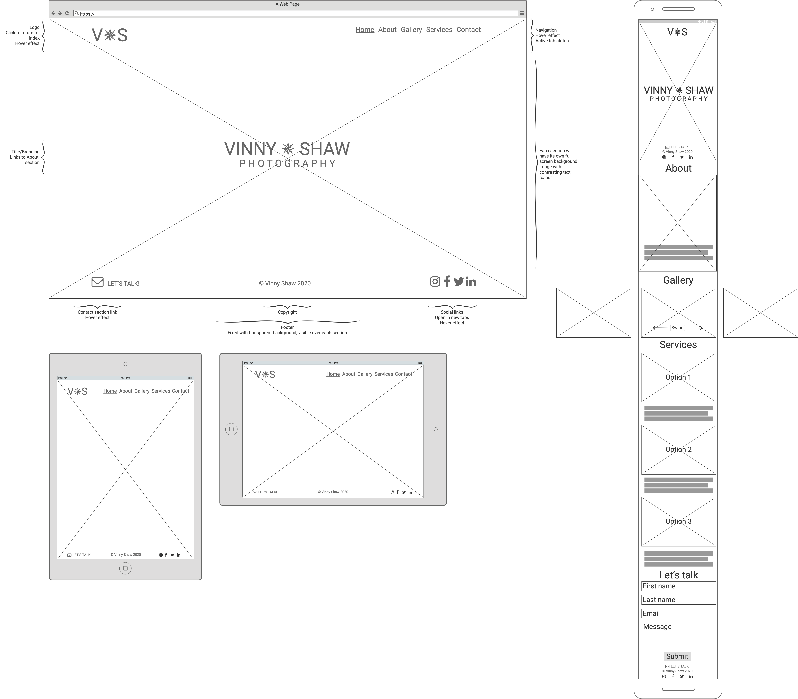

#### Mobile

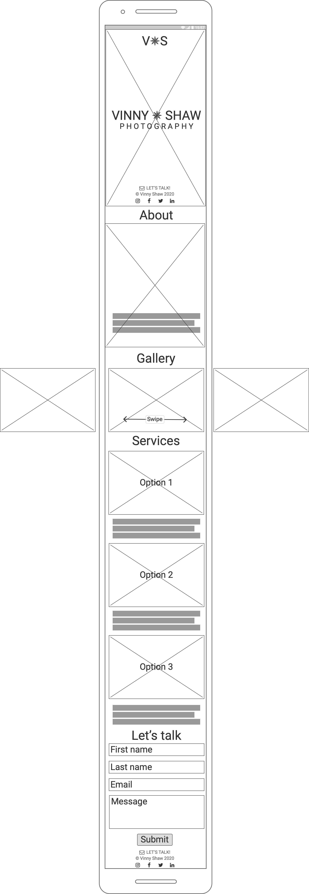

#### Desktop

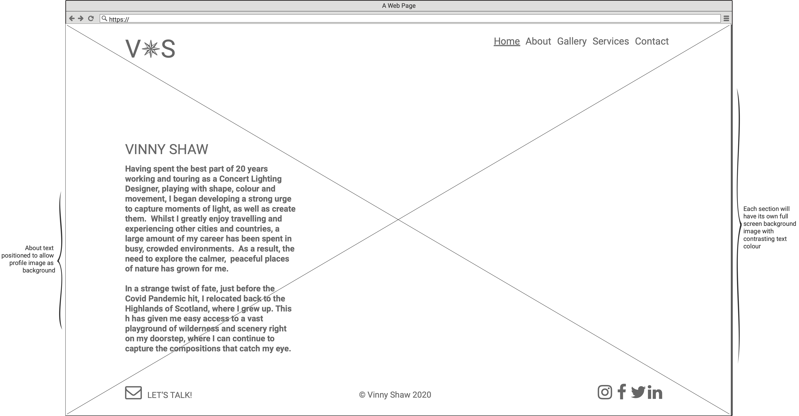
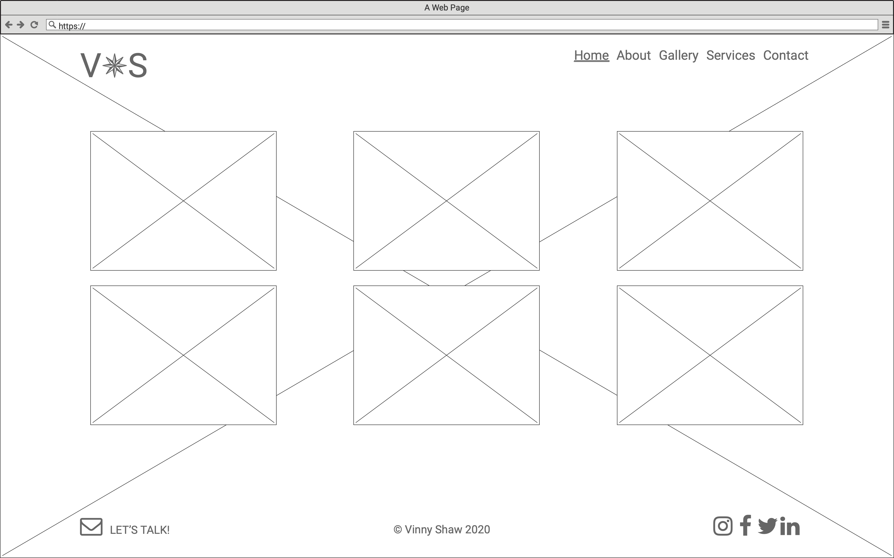
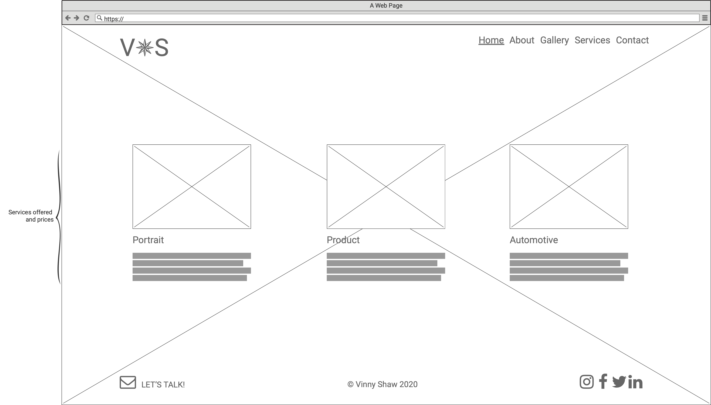
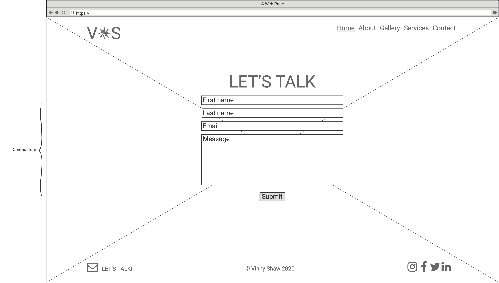

#### Mockups

#### Design alterations

- **Home navigation** - button hidden on smaller screens for a cleaner look.
- **Vinny Shaw** - title removed from About section for a cleaner look.
- **Lets Talk** - contact link hidden on smaller screens for a cleaner look.
- **Lets Talk** - form title hidden on smaller screens for a cleaner look.
- **Gallery** - Bootstrap carousel used across all screen sizes and devices.
- **Services** - Design changed from Bootstrap cards to a simpler image and title format.

#### Screenshots

iPhone 6 Portrait

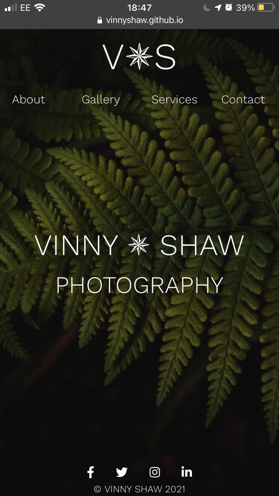
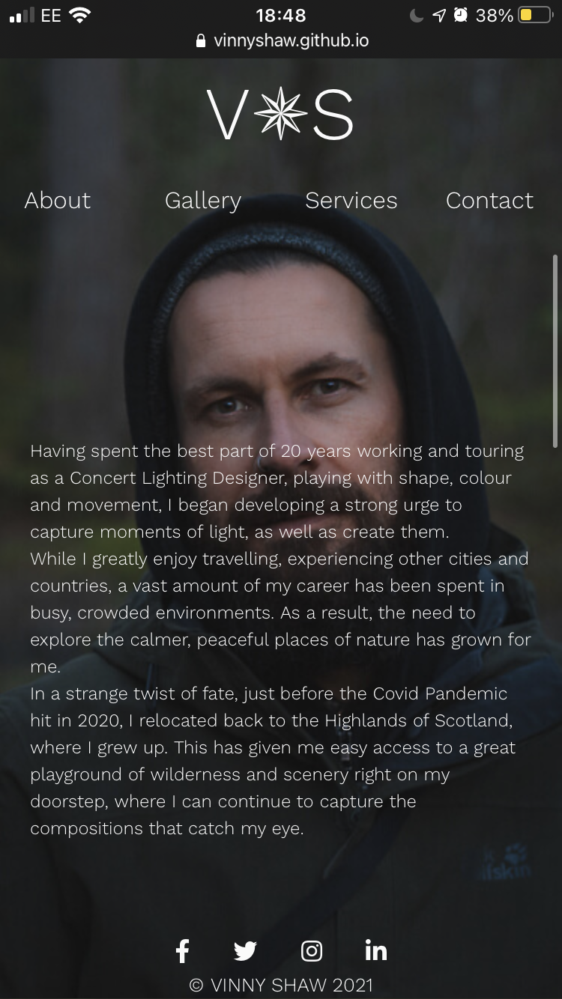
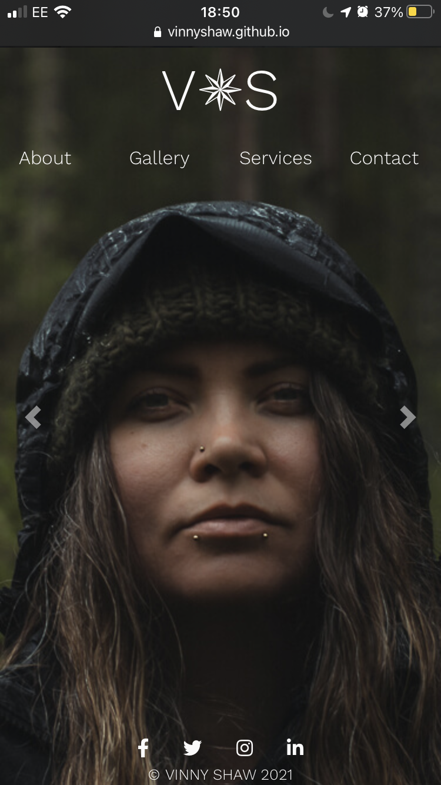

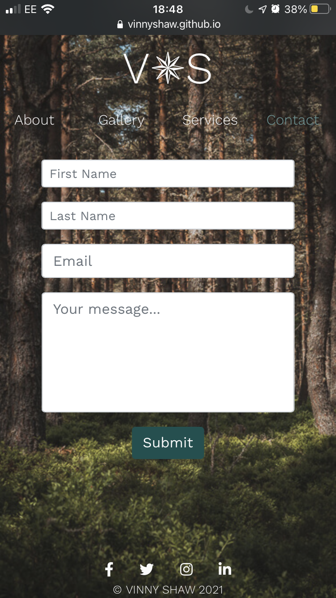

iPhone 6 Landscape

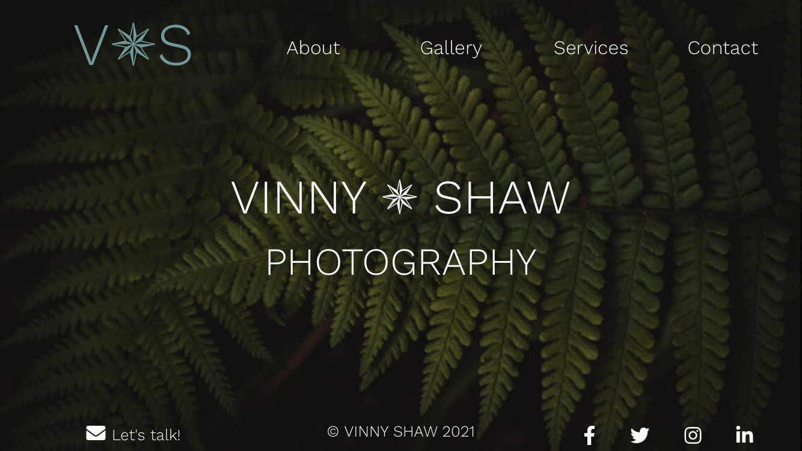
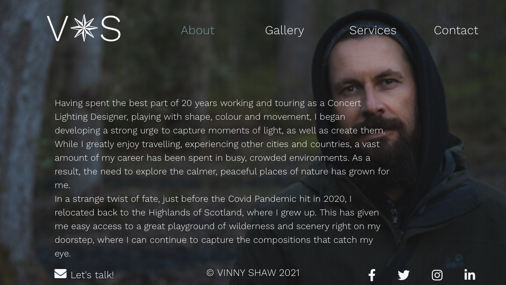
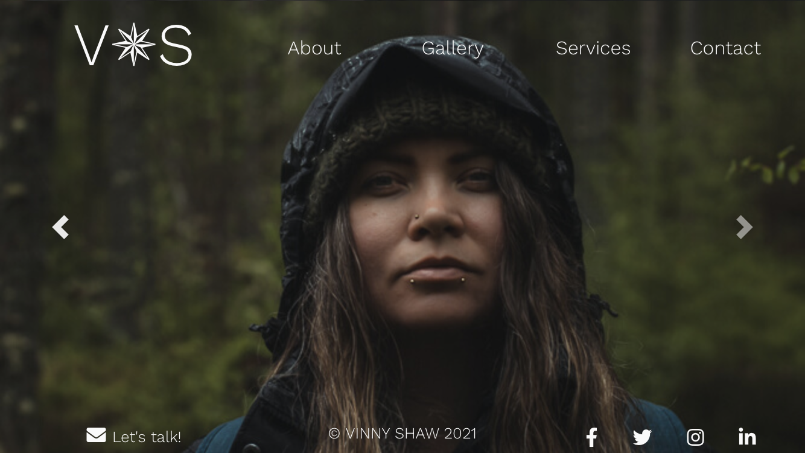
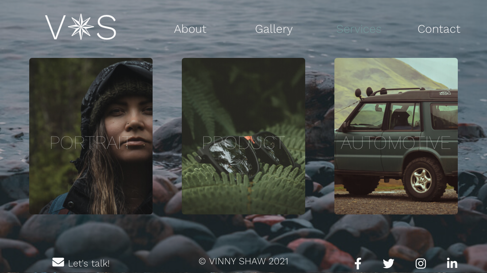
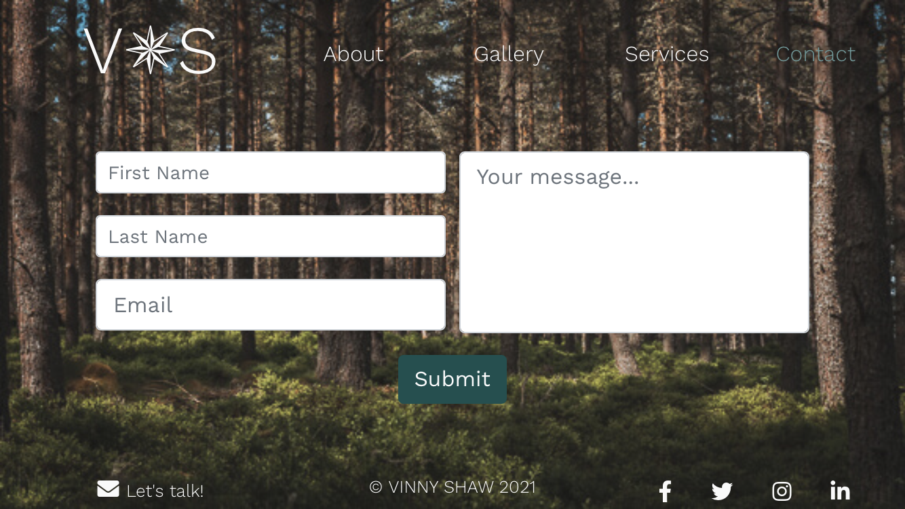

## [Return to main README document](https://github.com/VinnyShaw/vinny-shaw-photography-ci-ms1/blob/master/README.md)
